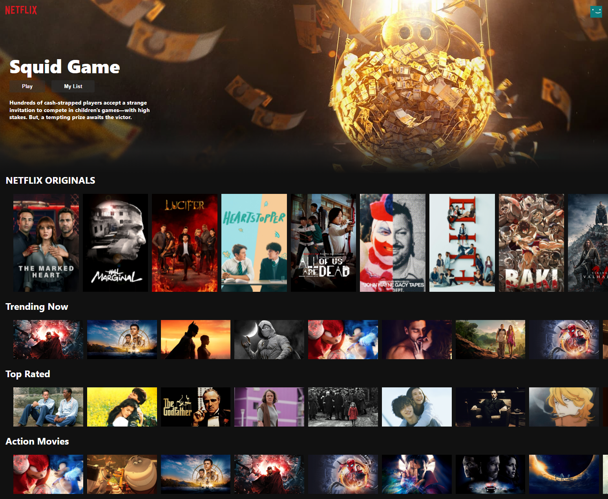

# Netflix-Clone

Click demo to try it by yourself!

The movie in the banner changes every time you refresh the page. You can also see that the background of the navbar changes when you scroll down the page. You can watch the trailers of the movies by clicking on them and you can scroll the lines to see more movies. Finally, you can reach my social media links in the footer.

## Netflix-Clone Demo Link

You can view the site here
[Click Me](https://netflix-clone-ozngrsc-v2.web.app/)

## Topics

- ReactJS
- JavaScript
- TMDB (The Movie Database) API
- React Router
- React Icons
- React Youtube
- Material UI
- Flexbox
- Responsive Design
- Deploy the App Live on Firebase

## Author

Ozan Gürsucu (ozngrsc)

